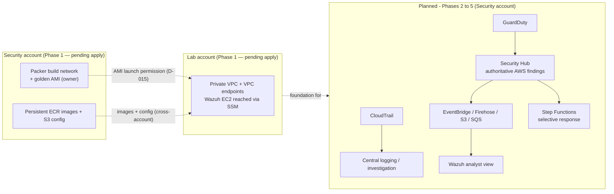

# CloudGuard (`cloud-secops-lab`)

A **reusable AWS cloud security operations lab** for detection engineering, investigation,
and selective automated response — built with Infrastructure as Code so an AWS environment
can be **deployed, tested, validated, documented, and destroyed** on demand.

The **repository is the permanent artifact**. Deployed AWS environments are **temporary and
cost-controlled** by design.

> **Status:** Phase 1 — Private Wazuh Platform — **IN PROGRESS**.
> The Packer prerequisite phase is **complete** and a **validated base AMI** exists — built
> in the **Management** account. CloudGuard has adopted the **Management / Security / Lab**
> account model ([docs/DECISIONS.md](docs/DECISIONS.md) D-014): the remaining Phase 1 work is
> to migrate the Packer build path to **Security**, build a Security-owned golden AMI and
> share it to **Lab**, stand up the persistent ECR/S3 artifact layer in Security, publish
> the Wazuh **4.14.7** images/config, and deploy + validate the disposable runtime in
> **Lab**. **Nothing has been applied in the Security or Lab accounts yet.** See
> [docs/CURRENT_STATE.md](docs/CURRENT_STATE.md).

---

## What exists today vs. what is planned

| Layer | State | Notes |
| --- | --- | --- |
| Private VPC, single private subnet, private route table | **Current** | `us-east-2`, `10.0.0.0/16`, no IGW, no NAT |
| VPC endpoints: S3 gateway + `ssm`/`ssmmessages`/`ec2messages`/`ecr.api`/`ecr.dkr` | **Current** | Endpoint security group allows 443 from the subnet only |
| EC2 IAM role / instance profile (SSM core + scoped ECR pull + scoped S3 read) | **Current** | `roles.tf` |
| 3 private immutable ECR repos (manager / indexer / dashboard) | **Moved to `terraform/wazuh-artifacts/`** | Persistent, Security-owned (D-016); not applied; nothing publishes images (B2). Legacy copy in `wazuh-project/` superseded |
| Private S3 artifact bucket (SSE-S3, block-public-access, TLS-deny policy) | **Moved to `terraform/wazuh-artifacts/`** | Persistent, Security-owned (D-016); not applied; no Wazuh 4.14.7 artifact set published (B3) |
| Wazuh EC2 Terraform definition + templated user-data (Lab) | **Partial** | No security group, no root-volume sizing, no IMDSv2 enforcement, no outputs; **runtime not applied**; must consume the shared Security AMI |
| Persistent Packer build network + least-privilege execution role (`terraform/packer-build/`) | **Applied in Management; migrate to Security** | VPC `10.10.0.0/24`, subnet, IGW, no-ingress SG, SSM builder profile, execution role (D-012/D-013). Code is account-agnostic |
| Packer base AMI (Ubuntu 24.04 + Docker/Compose/AWS CLI v2/`vm.max_map_count`/SSM) | **Validated in Management; re-build in Security** | Built + smoke-tested 2026-09-07 (evidence AMI `ami-0b1bf8942dfc0daf1` — historical evidence, not a config constant, not the future AMI) |
| Golden-AMI cross-account share Security → Lab (`ami_users` / `snapshot_users`) | **Implemented, not exercised** | Launch permission only, not public, no copy (D-015); required `var.lab_account_id` |
| Persistent ECR + S3 artifact layer (`terraform/wazuh-artifacts/`, Security) | **Implemented, not applied** | 3 private `IMMUTABLE` ECR repos + artifact bucket (block-public-access, SSE-S3, TLS-deny policy) — D-016 |
| End-to-end **runtime** Wazuh deploy validated via SSM (Lab) | **Not done** | Runtime VPC / instance not applied; migration + B2/B3 + cross-account policies remain |
| Multi-account model (Management / Security / Lab) | **Accepted (D-014); not applied** | Accounts + SSO permission sets exist; no CloudGuard infra in Security or Lab yet |
| CloudTrail, Security Hub, GuardDuty, Config, CloudWatch | **Planned** | Not present |
| `Security Hub → EventBridge → Firehose → S3 → SQS → Wazuh` ingestion | **Planned** | Not present |
| `Security Hub/EventBridge → Step Functions → selective response` (Lambda/SNS) | **Planned** | Not present |
| Lab-account workloads + Wazuh agents + SprintOps Tracker | **Planned** | Not present |
| Public dashboard (ALB + ACM) | **Deferred** | SSM port forwarding is the intended access path |
| Malware-analysis / vulnerability-management pipelines | **Deferred** | Explicitly out of MVP scope |

Legend: **Current** = implementation proves it exists (not necessarily deployed) · **Partial**
= scaffolding exists but the capability is incomplete/unvalidated · **Validated** = exercised
end-to-end and recorded · **Planned** = accepted direction, not implemented · **Deferred** =
intentionally excluded from the current phase. The Packer build path (build network,
execution role, base AMI) is Validated **in the Management account**; the D-014 migration to
Security/Lab and the runtime Wazuh deployment are not. See [docs/ROADMAP.md](docs/ROADMAP.md).

---

## Design principles

- **Private administrative access.** The Wazuh host is not publicly exposed for administration;
  AWS Systems Manager (Session Manager / port forwarding) is the access path.
- **No NAT Gateway for the current MVP.** Use VPC endpoints where practical — cheaper for a
  temporary lab.
- **Public Wazuh dashboard deferred.** ALB + ACM is not required for this phase.
- **AWS Security Hub stays authoritative** for AWS-native findings. Wazuh is the analyst /
  investigation surface, not the system of record for AWS findings.
- **Automated response is selective.** Not every finding triggers remediation.
- **Temporary environments.** `deploy → test → validate → document → destroy`.
- **Keep it reasonable.** The least infrastructure and code needed to be secure, clear,
  maintainable, and repeatable. Avoid unnecessary abstractions.

Decision records: [docs/DECISIONS.md](docs/DECISIONS.md).

---

## High-level architecture



Detailed diagrams (current + target): [docs/ARCHITECTURE.md](docs/ARCHITECTURE.md).

---

## Current phase summary

**Phase 1 — Private Wazuh Platform.** Goal: make the single-node Wazuh deployment
successfully deployable and validate it through SSM **before** starting any AWS
detection/ingestion work.

**Done:** the Packer prerequisite phase — a secure, isolated, persistent Packer build
network; a least-privilege execution role; the fixed bake script; and a **validated base
AMI** built and smoke-tested through Session Manager (in the Management account). Plus the
repository restructure for the three-account model (D-014/D-015/D-016).

**Remaining Phase 1 work:** run the **migration** (apply `terraform/packer-build/` in
Security → build a Security-owned AMI → share it to Lab → retire the Management copy → apply
`terraform/wazuh-artifacts/` in Security); publish the Wazuh **4.14.7** images to ECR (B2)
and the artifact set to S3 (B3); add cross-account ECR/S3 access for the Lab runtime; EC2
hardening + runtime outputs; then `terraform apply` the runtime (`terraform/wazuh-project/`,
Lab) and validate it end-to-end via SSM.

Canonical breakdown — remaining work, completion gaps, open decisions, and the exact next
task: **[docs/CURRENT_STATE.md](docs/CURRENT_STATE.md)** (kept current; not duplicated here).

---

## Documentation map

| Document | Purpose |
| --- | --- |
| [docs/PROJECT_CHARTER.md](docs/PROJECT_CHARTER.md) | Long-lived purpose, goals, principles, MVP definition, non-goals. |
| [docs/ARCHITECTURE.md](docs/ARCHITECTURE.md) | Current vs. target architecture, with diagrams. |
| [docs/CURRENT_STATE.md](docs/CURRENT_STATE.md) | **Primary development-handoff document.** Phase status, blockers, next task. |
| [docs/ROADMAP.md](docs/ROADMAP.md) | Phased plan (Phase 0–6) with status labels. |
| [docs/DECISIONS.md](docs/DECISIONS.md) | Lightweight architecture decision log. |
| [docs/RUNBOOK.md](docs/RUNBOOK.md) | Operational skeleton for deploy/validate/destroy (steps marked *Not yet operational* where applicable). |

Before contributing, read [AGENTS.md](AGENTS.md) — it defines the documentation reading
order, the source-of-truth hierarchy, and the handoff requirements every change must follow.

---

## Repository layout

```text
README.md                     project entry point (this file)
AGENTS.md                     contributor guide — reading order, source-of-truth, handoff rules
CLAUDE.md                     tool-specific instruction file (defers to AGENTS.md)
docs/                         project record (charter, architecture, state, roadmap, decisions, runbook)
packer/                       Ubuntu 24.04 Wazuh base AMI build — owned by the Security account (D-014)
  wazuh-ami.pkr.hcl                 source: build-network filters + assume_role + ami_users/snapshot_users (D-012/13/15)
  ami-sharing.pkr.hcl              required lab_account_id var (cross-account AMI share — D-015)
  build-identity.pkr.hcl           required packer_execution_role_arn var (from TF output)
  variables.pkr.hcl
  scripts/install-wazuh-base.sh    bake-time host provisioner (B1 done)
terraform/packer-build/       Terraform root - persistent Packer build network — SECURITY account (D-012/D-014)
  providers.tf variables.tf network.tf iam.tf packer-execution-role.tf outputs.tf   (applied in Management; migrate to Security)
terraform/wazuh-artifacts/    Terraform root - persistent ECR + S3 artifact layer — SECURITY account (D-016)   NOT applied
  providers.tf variables.tf ecr.tf storage.tf outputs.tf
terraform/wazuh-project/      Terraform root - disposable Wazuh runtime — LAB account (D-006/D-014)   NOT applied
  providers.tf variables.tf networking.tf endpoints.tf roles.tf ec2.tf outputs.tf (empty)
  ecr.tf storage.tf                 SUPERSEDED by terraform/wazuh-artifacts/ (removal blocked by stash@{0})
  scripts/install-wazuh.sh.tftpl    EC2 user-data template
```
