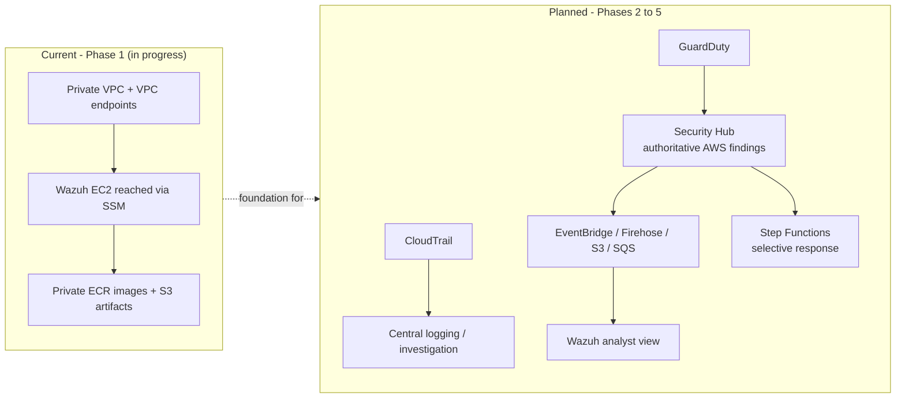

# CloudGuard (`cloud-secops-lab`)

A **reusable AWS cloud security operations lab** for detection engineering, investigation,
and selective automated response — built with Infrastructure as Code so an AWS environment
can be **deployed, tested, validated, documented, and destroyed** on demand.

The **repository is the permanent artifact**. Deployed AWS environments are **temporary and
cost-controlled** by design.

> **Status:** Phase 1 — Private Wazuh Foundation — **IN PROGRESS**.
> The private Wazuh infrastructure is scaffolded in Terraform/Packer but is **not yet
> end-to-end deployable**. See [docs/CURRENT_STATE.md](docs/CURRENT_STATE.md).

---

## What exists today vs. what is planned

| Layer | State | Notes |
| --- | --- | --- |
| Private VPC, single private subnet, private route table | **Current** | `us-east-2`, `10.0.0.0/16`, no IGW, no NAT |
| VPC endpoints: S3 gateway + `ssm`/`ssmmessages`/`ec2messages`/`ecr.api`/`ecr.dkr` | **Current** | Endpoint security group allows 443 from the subnet only |
| EC2 IAM role / instance profile (SSM core + scoped ECR pull + scoped S3 read) | **Current** | `roles.tf` |
| 3 private immutable ECR repos (manager / indexer / dashboard) | **Partial** | Created empty; nothing publishes images |
| Private S3 artifact bucket (SSE-S3, public access blocked) | **Partial** | Created empty; no Wazuh artifact set checked in / published |
| Wazuh EC2 Terraform definition + templated user-data | **Partial** | No security group, no root-volume sizing, no IMDSv2 enforcement, no outputs |
| Packer Ubuntu 24.04 AMI definition | **Partial** | Provisioner script currently holds runtime logic, not bake-time setup |
| End-to-end Wazuh deploy validated via SSM | **Not done** | No evidence of `terraform apply` / Packer build |
| Multi-account model (management / security / lab) | **Planned** | Single account, single provider today |
| CloudTrail, Security Hub, GuardDuty, Config, CloudWatch | **Planned** | Not present |
| `Security Hub → EventBridge → Firehose → S3 → SQS → Wazuh` ingestion | **Planned** | Not present |
| `Security Hub/EventBridge → Step Functions → selective response` (Lambda/SNS) | **Planned** | Not present |
| Lab-account workloads + Wazuh agents | **Planned** | Not present |
| Public dashboard (ALB + ACM) | **Deferred** | SSM port forwarding is the intended access path |
| Malware-analysis / vulnerability-management pipelines | **Deferred** | Explicitly out of MVP scope |

Legend: **Current** = implementation proves it exists (not necessarily deployed) · **Partial**
= scaffolding exists but the capability is incomplete/unvalidated · **Planned** = accepted
direction, not implemented · **Deferred** = intentionally excluded from the current phase.
[docs/ROADMAP.md](docs/ROADMAP.md) uses a finer split and adds **Validated** for items
exercised end-to-end. No components are currently recorded as Validated in the roadmap.

---

## Design principles

- **Private administrative access.** The Wazuh host is not publicly exposed for administration;
  AWS Systems Manager (Session Manager / port forwarding) is the access path.
- **No NAT Gateway for the current MVP.** Use VPC endpoints where practical — cheaper for a
  temporary lab.
- **Public Wazuh dashboard deferred.** ALB + ACM is not required for this phase.
- **AWS Security Hub stays authoritative** for AWS-native findings. Wazuh is the analyst /
  investigation surface, not the system of record for AWS findings.
- **Automated response is selective.** Not every finding triggers remediation.
- **Temporary environments.** `deploy → test → validate → document → destroy`.
- **Keep it reasonable.** The least infrastructure and code needed to be secure, clear,
  maintainable, and repeatable. Avoid unnecessary abstractions.

Decision records: [docs/DECISIONS.md](docs/DECISIONS.md).

---

## High-level architecture



Detailed diagrams (current + target): [docs/ARCHITECTURE.md](docs/ARCHITECTURE.md).

---

## Current phase summary

**Phase 1 — Private Wazuh Foundation.** Goal: make the single-node Wazuh deployment
successfully deployable and validate it through SSM **before** starting any AWS
detection/ingestion work.

The network/IAM/endpoint foundation is implemented. Three **hard blockers** stop a first
deployment — the Packer bake script contains runtime logic instead of image setup (B1),
there is no workflow to publish Wazuh images to ECR (B2), and there is no checked-in Wazuh
artifact set or S3 publish workflow (B3). Beyond those, Phase 1 still owes EC2 hardening,
Terraform outputs, a validated AMI, and a decision on **artifact bootstrap ordering** and
**artifact persistence vs. `terraform destroy`**.

Canonical breakdown — hard blockers, completion gaps, open decisions, and the exact next
task: **[docs/CURRENT_STATE.md](docs/CURRENT_STATE.md)** (kept current; not duplicated here).

---

## Documentation map

| Document | Purpose |
| --- | --- |
| [AGENTS.md](AGENTS.md) | **Start here if you are an AI coding agent.** Reading order, source-of-truth precedence, end-of-work handoff rules. |
| [CLAUDE.md](CLAUDE.md) | Pointer for Claude-based agents to `AGENTS.md`. |
| [docs/PROJECT_CHARTER.md](docs/PROJECT_CHARTER.md) | Long-lived purpose, goals, principles, MVP definition, non-goals. |
| [docs/ARCHITECTURE.md](docs/ARCHITECTURE.md) | Current vs. target architecture, with diagrams. |
| [docs/CURRENT_STATE.md](docs/CURRENT_STATE.md) | **Primary development-handoff document.** Phase status, blockers, next task. |
| [docs/ROADMAP.md](docs/ROADMAP.md) | Phased plan (Phase 0–6) with status labels. |
| [docs/DECISIONS.md](docs/DECISIONS.md) | Lightweight architecture decision log. |
| [docs/RUNBOOK.md](docs/RUNBOOK.md) | Operational skeleton for deploy/validate/destroy (steps marked *Not yet operational* where applicable). |

---

## Repository layout

```text
README.md                     project entry point (this file)
AGENTS.md                     mandatory starting point for AI agents
CLAUDE.md                     Claude-agent pointer to AGENTS.md
docs/                         project memory (charter, architecture, state, roadmap, decisions, runbook)
packer/                       Ubuntu 24.04 Wazuh AMI build (Partial)
  wazuh-ami.pkr.hcl
  variables.pkr.hcl
  scripts/install-wazuh-base.sh   (Partial - see blocker B1)
terraform/wazuh-project/      the only Terraform root module (private Wazuh foundation)
  providers.tf variables.tf networking.tf endpoints.tf roles.tf ecr.tf storage.tf ec2.tf
  main.tf outputs.tf              (empty placeholders)
  scripts/install-wazuh.sh.tftpl  EC2 user-data template
```
