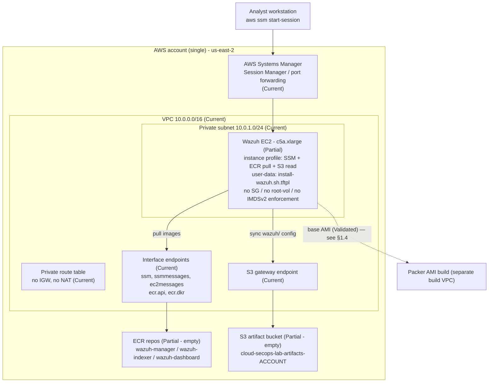
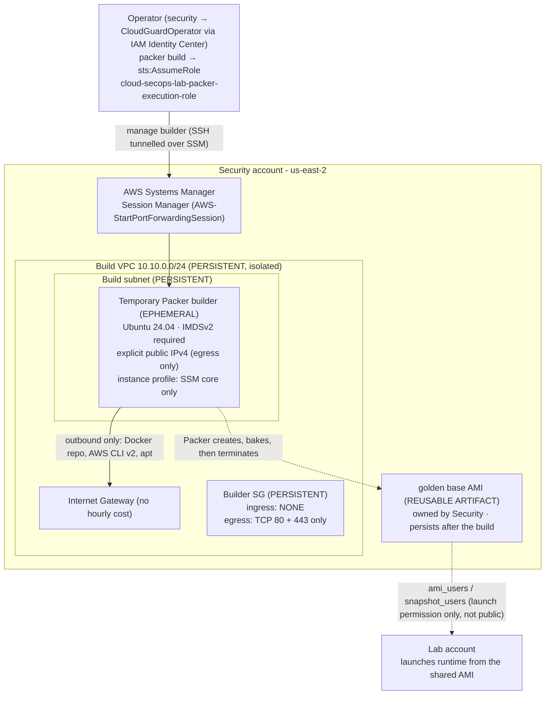
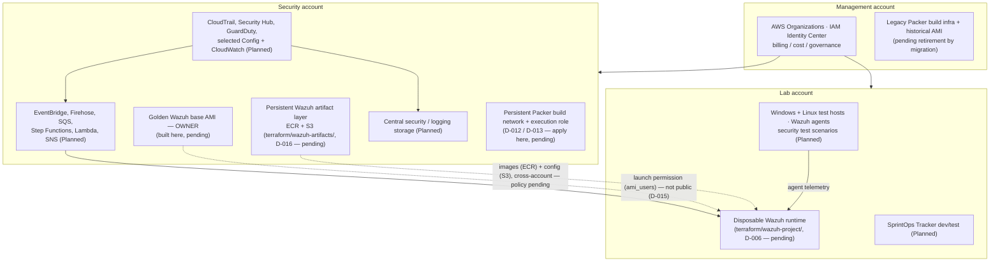
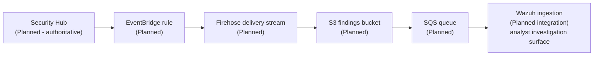
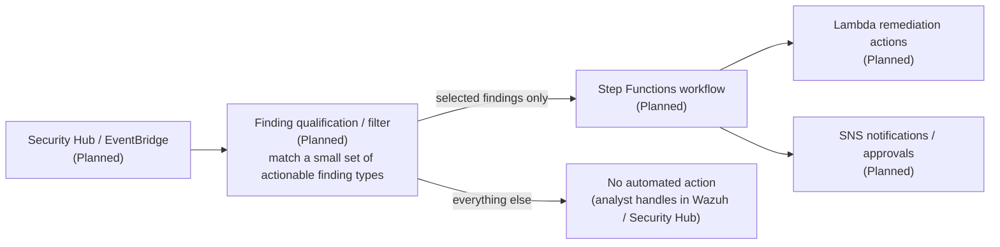
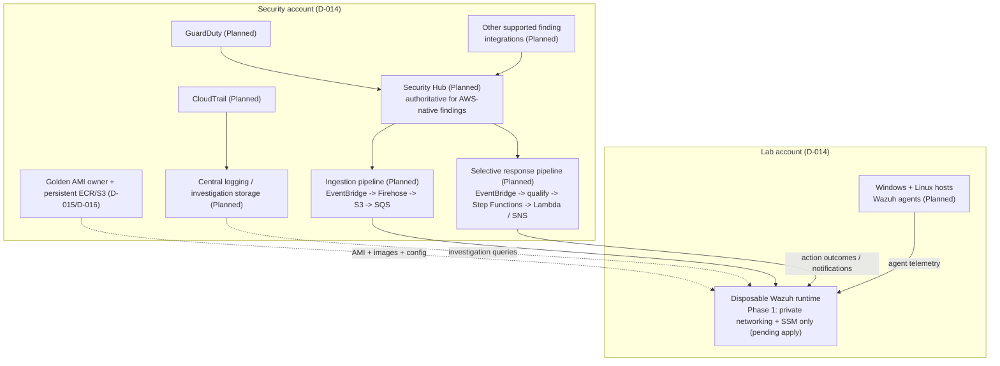

# CloudGuard — Architecture

> Distinguishes **Current** (implementation proves it exists), **Partial** (scaffolding exists,
> capability incomplete/unvalidated), **Planned** (accepted direction, not implemented), and
> **Deferred** (intentionally excluded from the current phase).
>
> Diagrams that show planned components label them explicitly. Do not read a planned box as
> existing infrastructure.

---

## 1. Current architecture (Phase 1 foundation)

**Scope:** region `us-east-2`, **three Terraform roots** —
[terraform/wazuh-project/](../terraform/wazuh-project/) (disposable Wazuh runtime, **Lab**
account), [terraform/packer-build/](../terraform/packer-build/) (persistent Packer build
network, **Security** account, [DECISIONS.md](DECISIONS.md) D-012), and
[terraform/wazuh-artifacts/](../terraform/wazuh-artifacts/) (persistent ECR + S3 artifact
layer, **Security** account, [DECISIONS.md](DECISIONS.md) D-016) — plus one Packer build
([packer/](../packer/)).

> **Account model (D-014, migration pending).** CloudGuard has adopted the
> Management / Security / Lab account model. **Nothing has been applied into the Security or
> Lab accounts yet.** What exists in AWS today is the *legacy* single-account placement: the
> persistent Packer build infrastructure and a validated base AMI
> (`ami-0b1bf8942dfc0daf1`) live in the **Management** account. The migration sequence
> (apply build infra in Security → build a new Security-owned AMI → share it to Lab →
> retire the Management copy → apply the artifact root in Security → deploy the runtime in
> Lab) is in [RUNBOOK.md](RUNBOOK.md). The Terraform code is account-agnostic (no account
> IDs committed; each root discovers its account at apply time), so migration is a matter of
> *which credentials run the apply*, not a code change.

### 1.1 Component status

| Component | State | Evidence |
| --- | --- | --- |
| AWS account model | **Accepted: Management / Security / Lab (D-014); migration pending** | three roots, each account-agnostic; legacy AWS state is still single-account (Management). No provider aliases — each root is applied with the target account's credentials |
| Region `us-east-2` | **Current** | `var.aws_region` default in [variables.tf](../terraform/wazuh-project/variables.tf); Packer default in [variables.pkr.hcl](../packer/variables.pkr.hcl) |
| VPC `10.0.0.0/16` (DNS support + hostnames) | **Current** | `aws_vpc.secops_lab_vpc` in [networking.tf](../terraform/wazuh-project/networking.tf) |
| One private subnet `10.0.1.0/24` (`us-east-2a`) | **Current** | `aws_subnet.private_1` in [networking.tf](../terraform/wazuh-project/networking.tf) |
| Private route table + association | **Current** | `aws_route_table.private_1_rt`, `aws_route_table_association.private_1` |
| No Internet Gateway | **Current (by design)** | no `aws_internet_gateway` anywhere |
| No NAT Gateway | **Current (by design)** | no `aws_nat_gateway` anywhere — see [DECISIONS.md](DECISIONS.md) D-002 |
| S3 gateway VPC endpoint (on the private route table) | **Current** | `aws_vpc_endpoint.s3_gateway` in [endpoints.tf](../terraform/wazuh-project/endpoints.tf) |
| Interface endpoints: `ssm`, `ssmmessages`, `ec2messages`, `ecr.api`, `ecr.dkr` | **Current** | `aws_vpc_endpoint.interface_endpoints` (`for_each` over `local.interface_services`) |
| Endpoint security group (443 from `subnet_cidr` only) | **Current** | `aws_security_group.vpc_endpoints` in [endpoints.tf](../terraform/wazuh-project/endpoints.tf) |
| EC2 IAM role + instance profile | **Current** | `aws_iam_role.wazuh_ec2`, `aws_iam_instance_profile.wazuh_ec2` in [roles.tf](../terraform/wazuh-project/roles.tf) |
| `AmazonSSMManagedInstanceCore` attached | **Current** | `aws_iam_role_policy_attachment.wazuh_ssm` |
| Scoped ECR pull policy (auth `*`; pull scoped to 3 repo ARNs) | **Current** | `aws_iam_role_policy.wazuh_ecr_pull` |
| Scoped S3 read policy (`wazuh/*` prefix of the artifact bucket) | **Current** | `aws_iam_role_policy.wazuh_s3_config_read` |
| 3 private ECR repos, `IMMUTABLE`, scan-on-push (persistent, Security — D-016) | **Implemented (not applied)** | [terraform/wazuh-artifacts/ecr.tf](../terraform/wazuh-artifacts/ecr.tf) — `for_each` over the 3 repo names; **no workflow publishes images (B2)**. Legacy duplicate in [wazuh-project/ecr.tf](../terraform/wazuh-project/ecr.tf) is superseded, pending stash resolution |
| S3 artifact bucket (`...-artifacts-<account_id>`, block-public-access, SSE-S3, TLS-deny policy) (persistent, Security — D-016) | **Implemented (not applied)** | [terraform/wazuh-artifacts/storage.tf](../terraform/wazuh-artifacts/storage.tf) — bucket + `aws_s3_bucket_policy` denying `aws:SecureTransport=false` (D-010); **empty; no publish workflow (B3)**. Legacy in [wazuh-project/storage.tf](../terraform/wazuh-project/storage.tf) is superseded |
| Wazuh EC2 instance (`c5a.xlarge`, private subnet, instance profile, templated user-data) | **Partial** | [ec2.tf](../terraform/wazuh-project/ec2.tf) — no security group, no `root_block_device`, no `metadata_options` (IMDSv2), depends on `var.wazuh_ami_id` (no default) |
| Packer Ubuntu 24.04 base AMI (`cloud-secops-wazuh-{{timestamp}}`, `c5a.xlarge` builder) | **Validated (in Management); re-build in Security pending** | [wazuh-ami.pkr.hcl](../packer/wazuh-ami.pkr.hcl) + [install-wazuh-base.sh](../packer/scripts/install-wazuh-base.sh) — built and smoke-tested `2026-09-07` in the **Management** account (evidence AMI `ami-0b1bf8942dfc0daf1`, `us-east-2`; historical evidence, not a config constant). D-014 migration: a **new Security-owned AMI** must be built and shared to Lab |
| Golden-AMI cross-account share to Lab (`ami_users` / `snapshot_users` = `var.lab_account_id`) | **Implemented (not exercised)** | [wazuh-ami.pkr.hcl](../packer/wazuh-ami.pkr.hcl) + [ami-sharing.pkr.hcl](../packer/ami-sharing.pkr.hcl), [DECISIONS.md](DECISIONS.md) D-015 — launch permission only, not public, no copy; unencrypted boot volume so no KMS |
| EC2 user-data bootstrap (`aws s3 sync` config, ECR login, `docker compose pull`/`up`) | **Partial** | [scripts/install-wazuh.sh.tftpl](../terraform/wazuh-project/scripts/install-wazuh.sh.tftpl) — depends on ECR/S3 content that does not exist |
| Wazuh Compose / configuration artifact set (checked in) | **Not present** | no `docker-compose.yml`, `generate-indexer-certs.yml`, or `ossec.conf`/manager config in the repo |
| Terraform outputs (runtime root) | **Not present** | [outputs.tf](../terraform/wazuh-project/outputs.tf) is an empty placeholder |
| Remote state backend | **Not present** | no `backend` block; local state (git-ignored) |
| Runtime Wazuh `terraform apply` (`terraform/wazuh-project/`) | **Not applied** | the `10.0.0.0/16` runtime VPC and all runtime resources exist only as code — nothing runtime-side is deployed |

**Packer build network** ([terraform/packer-build/](../terraform/packer-build/), [DECISIONS.md](DECISIONS.md) D-012) — **applied in AWS; exercised by a successful `packer build`**:

| Component | State | Evidence |
| --- | --- | --- |
| Dedicated build VPC `10.10.0.0/24` (isolated from the runtime `10.0.0.0/16` — no peering / TGW / connectivity), DNS on | **Applied** | `aws_vpc.build` in [network.tf](../terraform/packer-build/network.tf) |
| One build subnet, `map_public_ip_on_launch = false` | **Applied** | `aws_subnet.build` |
| Internet Gateway + `0.0.0.0/0` route + association | **Applied** | `aws_internet_gateway.build`, `aws_route.build_default` |
| Builder security group — **no ingress**; egress TCP 80 + 443 only | **Applied** | `aws_security_group.build` |
| Builder IAM role + `AmazonSSMManagedInstanceCore` **only** + instance profile | **Applied** | [iam.tf](../terraform/packer-build/iam.tf) |
| Packer **execution role** + least-privilege inline policy (assumed from `CloudGuardOperator`) | **Applied** | [packer-execution-role.tf](../terraform/packer-build/packer-execution-role.tf), [DECISIONS.md](DECISIONS.md) D-013 |
| Deterministic resource-specific `Name` tags on the VPC / subnet / SG (`cloud-secops-lab-packer-build-{vpc,subnet,sg}`) | **Applied** | `locals` in [network.tf](../terraform/packer-build/network.tf) |
| Packer source wired to the build network via **fail-closed** `Project`+`Purpose`+`Name` filters (no `most_free`/`random`), `assume_role`, SSM interface, IMDSv2, explicit public IP | **Validated** | [packer/wazuh-ami.pkr.hcl](../packer/wazuh-ami.pkr.hcl) — a build selected the network, tunnelled over SSM (`AWS-StartPortForwardingSession`), baked, and produced a validated AMI |
| NAT Gateway in the build network | **Not present (by design)** | IGW only; egress is public, no hourly NAT charge |

### 1.2 Current foundation diagram

> The Wazuh runtime VPC above is **code only — not applied**. The Packer build VPC (§1.4) is
> a separate, isolated network; there is no connectivity between the two.

### 1.3 Known-incomplete parts of the current Wazuh path

[CURRENT_STATE.md](CURRENT_STATE.md) is canonical for the blocker/gap model. Summary:

**Hard deployment blockers** (the deployment cannot succeed until these are resolved):

| ID | Gap | Effect |
| --- | --- | --- |
| ~~B1~~ | **DONE.** [packer/scripts/install-wazuh-base.sh](../packer/scripts/install-wazuh-base.sh) installs host prerequisites only and was proven by a successful build + AMI smoke test (2026-09-07). |
| B2 | No working workflow publishes Wazuh images into the 3 ECR repos | `docker compose pull` from the private registry fails |
| B3 | No complete Wazuh Compose/config artifact set in the repo, and no workflow publishes it to `s3://<bucket>/wazuh/` | `aws s3 sync` retrieves nothing; the stack has no definition to run |

**Phase 1 completion / hardening gaps** (needed to *finish* Phase 1):

| Gap | Effect |
| --- | --- |
| ~~No validated AMI~~ | **DONE.** A trusted base AMI exists (evidence `ami-0b1bf8942dfc0daf1`, `us-east-2`, 2026-09-07). `var.wazuh_ami_id` still takes an explicit value by design. |
| EC2 has no dedicated security group | Wazuh-agent and dashboard traffic rules undefined |
| EC2 has no explicit `root_block_device` | Root volume defaults to the AMI size; may be undersized for the indexer |
| EC2 has no `metadata_options` | IMDSv2 not enforced |
| [outputs.tf](../terraform/wazuh-project/outputs.tf) empty | No machine-readable instance ID / bucket name for the SSM access runbook |

Historical note: an earlier design used `t3.large` with an explicit ~50 GB EBS root volume.
Current Terraform uses `c5a.xlarge` and **no** explicit root-volume block (AMI default size
applies). Root-volume sizing is an open Phase 1 completion item.

### 1.4 Packer build path (validated in Management 2026-09-07; re-home to Security pending — D-014)

The AMI is baked in a **persistent, isolated build network** ([DECISIONS.md](DECISIONS.md)
D-012) that is separate from the Wazuh runtime (no peering, no transit gateway, no
connectivity between the two VPCs) and outlives individual builds. Persistent =
control-plane only (no hourly cost). The builder itself is ephemeral and Packer-managed.
The path is **proven** (it ran end-to-end in the Management account): operator →
`assume_role` `cloud-secops-lab-packer-execution-role` → build network → SSM port-forwarding
tunnel → bake → AMI → builder + key-pair cleanup.

Under D-014 this whole path **moves to the Security account** (apply `terraform/packer-build/`
with `security-admin`, run builds as `security`). The build then also **shares the resulting
AMI to the Lab account** by launch permission (D-015). The diagram shows the target
(Security) placement.

Key points: no public inbound to the builder; management is SSM-only; the public IPv4 is a
deliberate, scoped opt-in for egress; no NAT Gateway. Packer finds the network by
deterministic `Project`+`Purpose`+`Name` tag filters and the instance profile by exact name
(no generated IDs in source); the filters **identify** the resources and the build is
**fail-closed** — an ambiguous match aborts rather than picking one. The AMI is shared to
exactly one named account (`var.lab_account_id`, required, no default) — never public, never
wildcard, no copy into Lab.

---

## 2. Target architecture

Everything in this section is **Planned** unless a box is explicitly marked otherwise.

### 2.1 Account model (Accepted — D-014; migration pending)

> **Accepted, not yet migrated.** [DECISIONS.md](DECISIONS.md) D-014 records the
> Management / Security / Lab model and the migration sequence. The accounts and their IAM
> Identity Center permission sets **exist**. **No CloudGuard infrastructure has been applied
> into Security or Lab yet** — the persistent Packer build infrastructure and the validated
> base AMI are still in the **Management** account (legacy placement) until the migration
> retires them. Boxes below are the accepted target; "pending" marks what has not moved.

Logical responsibilities:

| Account | Responsibility | Access (IAM Identity Center) |
| --- | --- | --- |
| Management | AWS Organizations, IAM Identity Center, billing / cost / governance. No normal workload or security tooling after migration. | `cloudguard-admin` → AdministratorAccess |
| Security | Persistent Packer build infrastructure + execution role; **golden AMI owner**; persistent Wazuh ECR/S3 artifact layer; future centralized security tooling (AWS-native detection, ingestion + response pipelines, central logging, security VPC). | `security-admin` → AdministratorAccess · `security` → `CloudGuardOperator` |
| Lab | Disposable Wazuh runtime; security-test workloads and Wazuh agents; SprintOps Tracker dev/test. | `lab-admin` → AdministratorAccess · `lab` → `LabOperator` |

### 2.2 Target findings ingestion

Purpose: give analysts AWS findings inside Wazuh **without** making Wazuh authoritative for
those findings. Security Hub remains the system of record — see [DECISIONS.md](DECISIONS.md)
D-003.

### 2.3 Target selective automated response

Response is **selective** by design — see [DECISIONS.md](DECISIONS.md) D-004.

### 2.4 Target end-state (conceptual)

> All boxes **Planned** unless noted. Account placement follows the accepted
> Management / Security / Lab model (D-014); the detection/ingestion/response tooling shown
> here is not built yet.
>
> Note the finding paths: **CloudTrail feeds central logging / investigation**, not Security
> Hub directly. **GuardDuty** (and other supported finding integrations) feed Security Hub.
> Security Hub stays authoritative for AWS-native findings (D-003) and is the source for both
> the Wazuh ingestion pipeline and the selective-response pipeline.

> Whether the analyst-facing Wazuh platform stays a per-session Lab runtime or later becomes
> persistent in Security (once it consumes ingested findings continuously) is a **later
> decision**, out of scope for D-014. Phase 1 places it in Lab as the disposable runtime.

---

## 3. Cross-cutting architectural decisions

See [DECISIONS.md](DECISIONS.md) for full records. Summary:

| ID | Decision | Status |
| --- | --- | --- |
| D-001 | Private administrative access via AWS Systems Manager; no public admin surface. | Accepted |
| D-002 | No NAT Gateway for the current MVP; use VPC endpoints where practical. | Accepted |
| D-003 | AWS Security Hub is authoritative for AWS-native findings; Wazuh is analyst/investigation only. | Accepted |
| D-004 | Automated response is selective, not universal. | Accepted |
| D-005 | Public Wazuh dashboard (ALB/ACM) deferred; SSM port forwarding is the access path. | Accepted |
| D-006 | Temporary environment lifecycle: deploy → test → validate → document → destroy. | Accepted |
| D-007 | Multi-account transition point (was open). | Superseded by D-014 |
| D-008 | Keep implementation minimal and maintainable; avoid unnecessary abstractions. | Accepted |
| D-009 | Wazuh delivery via private ECR + S3 config, no runtime internet dependency (implementation incomplete). | Accepted |
| D-010 | Artifact bucket encryption — SSE-S3 at rest + enforced TLS in transit for Phase 1; SSE-KMS (CMK) deferred. | Accepted |
| D-011 | Custom AMI = stable host prerequisites only; runtime layer owns Wazuh deployment state (version, images, config, certs). | Accepted |
| D-012 | Persistent dedicated Packer build network (own Terraform root); ephemeral builder with explicit public egress, no public admin ingress, SSM Session Manager management, IMDSv2; deterministic fail-closed resource selection. **PB-1 COMPLETE** — applied + build-validated. | Accepted |
| D-013 | Least-privilege IAM identity for running Packer: `cloud-secops-lab-packer-execution-role` trusted only by the `CloudGuardOperator` IAM Identity Center role (resilient `ArnLike` pattern), assumed by Packer; separate from the builder instance role; bootstrap apply via `AdministratorAccess`. **PB-4 COMPLETE** — applied + build-validated (in Management). | Accepted |
| D-014 | Adopt the three-account model (Management / Security / Lab) with named permission sets; component placement fixed; Terraform stays account-agnostic; migration sequence recorded. Supersedes D-007. | Accepted |
| D-015 | Golden AMI owned by Security, shared to Lab by launch permission only (`ami_users` / `snapshot_users` = required `var.lab_account_id`); never public, no wildcard, no copy; unencrypted boot volume so no KMS today (CMK deferred if encryption is added). | Accepted |
| D-016 | Persistent Wazuh artifact layer (ECR + S3) is its own Terraform root `terraform/wazuh-artifacts/` in the Security account; SSE-S3 + TLS-deny bucket policy; legacy definitions in `wazuh-project/` superseded (removal pending stash resolution). | Accepted |
