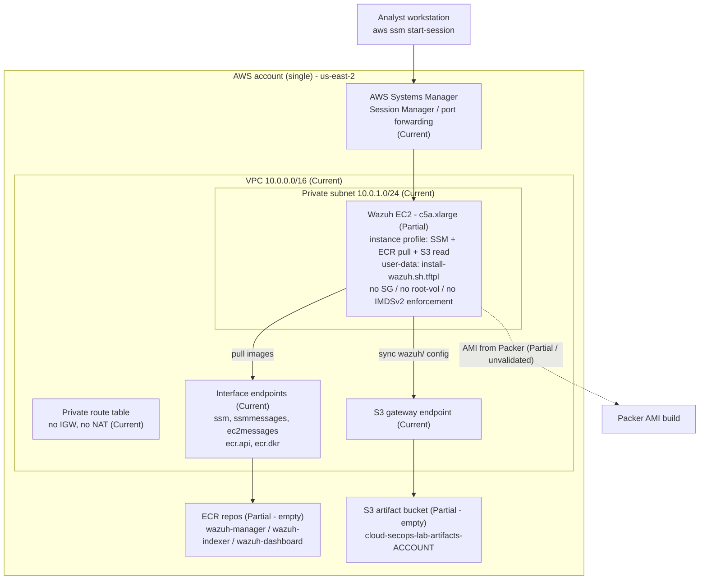
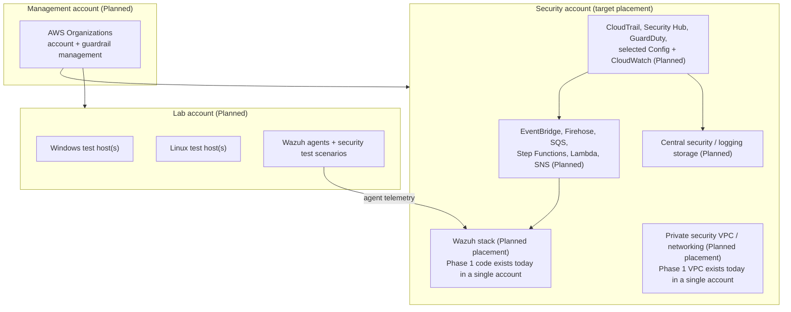
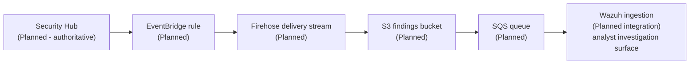
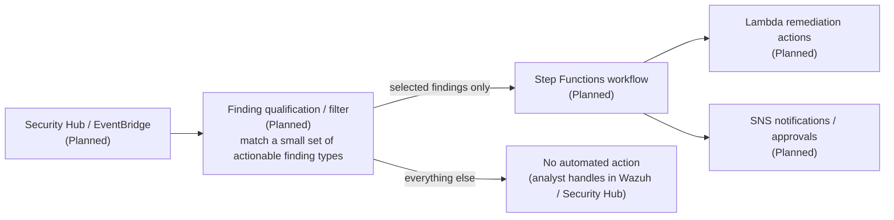
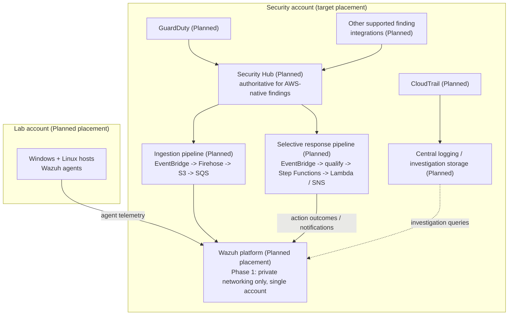

# CloudGuard — Architecture

> Distinguishes **Current** (implementation proves it exists), **Partial** (scaffolding exists,
> capability incomplete/unvalidated), **Planned** (accepted direction, not implemented), and
> **Deferred** (intentionally excluded from the current phase).
>
> Diagrams that show planned components label them explicitly. Do not read a planned box as
> existing infrastructure.

---

## 1. Current architecture (Phase 1 foundation)

**Scope:** a single AWS account, region `us-east-2`, one Terraform root module
([terraform/wazuh-project/](../terraform/wazuh-project/)) and one Packer build
([packer/](../packer/)).

### 1.1 Component status

| Component | State | Evidence |
| --- | --- | --- |
| AWS account model | **Current: single account** | one `provider "aws"` in [providers.tf](../terraform/wazuh-project/providers.tf); no provider aliases / `assume_role` |
| Region `us-east-2` | **Current** | `var.aws_region` default in [variables.tf](../terraform/wazuh-project/variables.tf); Packer default in [variables.pkr.hcl](../packer/variables.pkr.hcl) |
| VPC `10.0.0.0/16` (DNS support + hostnames) | **Current** | `aws_vpc.secops_lab_vpc` in [networking.tf](../terraform/wazuh-project/networking.tf) |
| One private subnet `10.0.1.0/24` (`us-east-2a`) | **Current** | `aws_subnet.private_1` in [networking.tf](../terraform/wazuh-project/networking.tf) |
| Private route table + association | **Current** | `aws_route_table.private_1_rt`, `aws_route_table_association.private_1` |
| No Internet Gateway | **Current (by design)** | no `aws_internet_gateway` anywhere |
| No NAT Gateway | **Current (by design)** | no `aws_nat_gateway` anywhere — see [DECISIONS.md](DECISIONS.md) D-002 |
| S3 gateway VPC endpoint (on the private route table) | **Current** | `aws_vpc_endpoint.s3_gateway` in [endpoints.tf](../terraform/wazuh-project/endpoints.tf) |
| Interface endpoints: `ssm`, `ssmmessages`, `ec2messages`, `ecr.api`, `ecr.dkr` | **Current** | `aws_vpc_endpoint.interface_endpoints` (`for_each` over `local.interface_services`) |
| Endpoint security group (443 from `subnet_cidr` only) | **Current** | `aws_security_group.vpc_endpoints` in [endpoints.tf](../terraform/wazuh-project/endpoints.tf) |
| EC2 IAM role + instance profile | **Current** | `aws_iam_role.wazuh_ec2`, `aws_iam_instance_profile.wazuh_ec2` in [roles.tf](../terraform/wazuh-project/roles.tf) |
| `AmazonSSMManagedInstanceCore` attached | **Current** | `aws_iam_role_policy_attachment.wazuh_ssm` |
| Scoped ECR pull policy (auth `*`; pull scoped to 3 repo ARNs) | **Current** | `aws_iam_role_policy.wazuh_ecr_pull` |
| Scoped S3 read policy (`wazuh/*` prefix of the artifact bucket) | **Current** | `aws_iam_role_policy.wazuh_s3_config_read` |
| 3 private ECR repos, `IMMUTABLE`, scan-on-push | **Partial** | [ecr.tf](../terraform/wazuh-project/ecr.tf) — repos created but **no workflow publishes images** |
| S3 artifact bucket (`...-artifacts-<account_id>`, public access blocked, SSE-S3 AES256) | **Partial** | [storage.tf](../terraform/wazuh-project/storage.tf) — bucket created but **empty**; no versioning, no bucket policy |
| Wazuh EC2 instance (`c5a.xlarge`, private subnet, instance profile, templated user-data) | **Partial** | [ec2.tf](../terraform/wazuh-project/ec2.tf) — no security group, no `root_block_device`, no `metadata_options` (IMDSv2), depends on `var.wazuh_ami_id` (no default) |
| Packer Ubuntu 24.04 AMI (`cloud-secops-wazuh-{{timestamp}}`, `c5a.xlarge` builder) | **Partial** | [wazuh-ami.pkr.hcl](../packer/wazuh-ami.pkr.hcl) — provisioner script holds runtime logic, not bake-time setup |
| EC2 user-data bootstrap (`aws s3 sync` config, ECR login, `docker compose pull`/`up`) | **Partial** | [scripts/install-wazuh.sh.tftpl](../terraform/wazuh-project/scripts/install-wazuh.sh.tftpl) — depends on ECR/S3 content that does not exist |
| Wazuh Compose / configuration artifact set (checked in) | **Not present** | no `docker-compose.yml`, `generate-indexer-certs.yml`, or `ossec.conf`/manager config in the repo |
| Terraform outputs | **Not present** | [outputs.tf](../terraform/wazuh-project/outputs.tf) is an empty placeholder; [main.tf](../terraform/wazuh-project/main.tf) also empty |
| Remote state backend | **Not present** | no `backend` block; local state (git-ignored) |
| `terraform apply` / Packer build ever run and validated | **No evidence** | nothing in git history or working tree indicates a successful deploy |

### 1.2 Current foundation diagram

### 1.3 Known-incomplete parts of the current Wazuh path

[CURRENT_STATE.md](CURRENT_STATE.md) is canonical for the blocker/gap model. Summary:

**Hard deployment blockers** (the deployment cannot succeed until these are resolved):

| ID | Gap | Effect |
| --- | --- | --- |
| B1 | [packer/scripts/install-wazuh-base.sh](../packer/scripts/install-wazuh-base.sh) is byte-identical to the runtime user-data template and contains startup logic, not bake-time setup | No validated AMI with Docker Engine, the Docker Compose plugin, or `vm.max_map_count=262144`; user-data then fails |
| B2 | No working workflow publishes Wazuh images into the 3 ECR repos | `docker compose pull` from the private registry fails |
| B3 | No complete Wazuh Compose/config artifact set in the repo, and no workflow publishes it to `s3://<bucket>/wazuh/` | `aws s3 sync` retrieves nothing; the stack has no definition to run |

**Phase 1 completion / hardening gaps** (needed to *finish and validate* Phase 1, not to get a first boot):

| Gap | Effect |
| --- | --- |
| No validated AMI produced by the repaired Packer workflow (feeds `var.wazuh_ami_id`) | `var.wazuh_ami_id` taking an explicit value is acceptable; the missing capability is a *trusted* AMI to put there |
| EC2 has no dedicated security group | Agent/dashboard traffic rules undefined |
| EC2 has no explicit `root_block_device` | Root volume defaults to the AMI size; may be undersized for the indexer |
| EC2 has no `metadata_options` | IMDSv2 not enforced |
| [outputs.tf](../terraform/wazuh-project/outputs.tf) empty | No machine-readable instance ID / bucket name for the SSM access runbook |

Historical note: an earlier design used `t3.large` with an explicit ~50 GB EBS root volume.
Current Terraform uses `c5a.xlarge` and **no** explicit root-volume block (AMI default size
applies). Root-volume sizing is an open Phase 1 completion item.

---

## 2. Target architecture

Everything in this section is **Planned** unless a box is explicitly marked otherwise.

### 2.1 Target account model

> **Target placement.** The boxes below describe where components are *intended* to live.
> The current Phase 1 implementation (VPC, endpoints, IAM, ECR, S3, EC2) runs in a
> **single-account environment** — see [DECISIONS.md](DECISIONS.md) D-007. Nothing has been
> deployed into a dedicated Security or Lab account yet.

Logical responsibilities:

| Account | Responsibility |
| --- | --- |
| Management | Organization structure, account provisioning, org-level guardrails. |
| Security | All centralized security tooling: Wazuh, AWS-native detection, ingestion pipeline, response workflows, central logging, security VPC. |
| Lab | Disposable workloads that generate telemetry and findings; Wazuh agents; attack/test scenarios. |

### 2.2 Target findings ingestion

Purpose: give analysts AWS findings inside Wazuh **without** making Wazuh authoritative for
those findings. Security Hub remains the system of record — see [DECISIONS.md](DECISIONS.md)
D-003.

### 2.3 Target selective automated response

Response is **selective** by design — see [DECISIONS.md](DECISIONS.md) D-004.

### 2.4 Target end-state (conceptual)

> All boxes **Planned** unless noted. Account placement is target placement — today's
> Phase 1 resources are single-account (D-007).
>
> Note the finding paths: **CloudTrail feeds central logging / investigation**, not Security
> Hub directly. **GuardDuty** (and other supported finding integrations) feed Security Hub.
> Security Hub stays authoritative for AWS-native findings (D-003) and is the source for both
> the Wazuh ingestion pipeline and the selective-response pipeline.

---

## 3. Cross-cutting architectural decisions

See [DECISIONS.md](DECISIONS.md) for full records. Summary:

| ID | Decision | Status |
| --- | --- | --- |
| D-001 | Private administrative access via AWS Systems Manager; no public admin surface. | Accepted |
| D-002 | No NAT Gateway for the current MVP; use VPC endpoints where practical. | Accepted |
| D-003 | AWS Security Hub is authoritative for AWS-native findings; Wazuh is analyst/investigation only. | Accepted |
| D-004 | Automated response is selective, not universal. | Accepted |
| D-005 | Public Wazuh dashboard (ALB/ACM) deferred; SSM port forwarding is the access path. | Accepted |
| D-006 | Temporary environment lifecycle: deploy → test → validate → document → destroy. | Accepted |
| D-007 | Multi-account transition point — Phase 1 stays single-account; when to adopt the management/security/lab model is open. | Proposed |
| D-008 | Keep implementation minimal and maintainable; avoid unnecessary abstractions. | Accepted |
| D-009 | Wazuh delivery via private ECR + S3 config, no runtime internet dependency (implementation incomplete). | Accepted |
| D-010 | Artifact bucket encryption — SSE-S3 today; SSE-S3 vs. CMK for Phase 1 is open. | Proposed |
